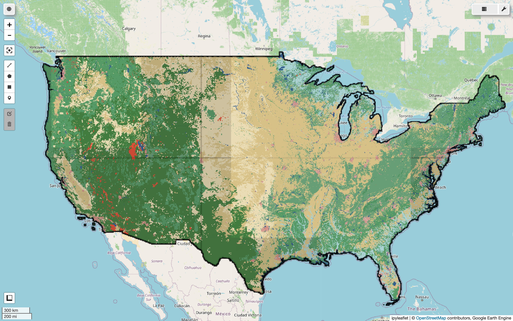
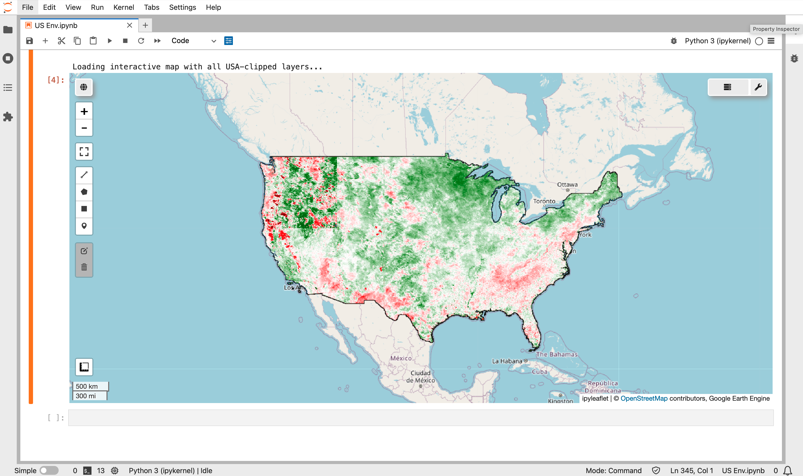

# 🇺🇸 USA Environmental Monitoring System

[](https://earthengine.google.com/)
[](https://www.python.org/)
[](LICENSE)

A comprehensive environmental monitoring dashboard for the United States (including Alaska and Hawaii) using Google Earth Engine. This tool analyzes land cover, temperature patterns, water resources, soil erosion risk, drought conditions, and urban heat islands.

---

## 📊 Key Visualizations

### 🗺️ Land Use / Land Cover (NLCD 2021)


*National Land Cover Database 2021 showing land use patterns across the USA*

---

### 🌡️ Temperature Analysis

| Parameter | Visualization |
|-----------|---------------|
| **Mean Annual LST** | .png) |
| **Summer LST** | .png) |
| **Winter LST** |  |

*Land Surface Temperature patterns across seasons - Note the temperature gradient from northern to southern states*

---

### 🏔️ Topography & Elevation

.png)

*SRTM elevation data showing mountain ranges (Rockies, Appalachians) and lowlands*

---

### 🌿 Vegetation & Drought Monitoring

| Metric | Visualization |
|--------|---------------|
| **NDVI (Vegetation Health)** |  |
| **NDVI Anomaly** |  |
| **Drought Severity** |  |

*Vegetation health indicators showing drought-affected regions (red/orange areas indicate vegetation stress)*

---

## 📋 Features Overview

| Category | Layer | Data Source | Resolution |
|----------|-------|-------------|------------|
| **Land Cover** | NLCD 2021 Land Use/Land Cover | USGS NLCD | 30m |
| **Temperature** | Mean Annual LST | MODIS MOD11A2 | 1km |
| **Temperature** | Summer LST (June-August) | MODIS MOD11A2 | 1km |
| **Temperature** | Winter LST (December-February) | MODIS MOD11A2 | 1km |
| **Topography** | Elevation | SRTM | 30m |
| **Vegetation** | NDVI | MODIS MOD13Q1 | 500m |
| **Drought** | NDVI Anomaly (vs 2015-2019) | MODIS MOD13Q1 | 500m |
| **Drought** | Drought Severity Classification | MODIS MOD13Q1 | 500m |
| **Water** | Water Bodies (MNDWI) | Landsat 8 | 30m |
| **Erosion** | Soil Erosion Risk Index | SRTM + MODIS | 500m |
| **Urban** | Urban Heat Island Intensity | MODIS + NLCD | 1km |

---

## 🚀 Quick Start

### Prerequisites

```bash
pip install earthengine-api geemap folium matplotlib numpy
```

### Authentication (First Time Only)

```python
import ee
ee.Authenticate()  # Opens browser for Google auth
ee.Initialize()
```

### Run the Analysis

```python
python usa_environmental_monitoring.py
```

---

## 📈 Analysis Period

| Parameter | Value |
|-----------|-------|
| **Start Date** | 2020-01-01 |
| **End Date** | 2024-12-31 |
| **Historical Baseline** | 2015-2019 (for drought analysis) |
| **Total USA Area** | ~9.8 million km² |

---

## 🗺️ Interactive Map

The script generates an interactive Folium map (`gee_exports/USA_Environmental_Map.html`) with:

- ✅ Toggle layers on/off
- ✅ Click for pixel values
- ✅ Export as PNG or GeoTIFF
- ✅ Zoom and pan functionality

---

## 📤 Export Options

### Export to Google Drive (GeoTIFF)

```python
def export_layer_to_drive(image, layer_name, scale=1000):
    task = ee.batch.Export.image.toDrive(
        image=image,
        description=f'USA_{layer_name}',
        folder='GEE_Exports_USA',
        fileNamePrefix=f'USA_{layer_name}',
        region=usa_boundary,
        scale=scale,
        maxPixels=1e13,
        fileFormat='GeoTIFF'
    )
    task.start()

# Export layers
export_layer_to_drive(lst_mean, 'Mean_LST', 1000)
export_layer_to_drive(water_bodies, 'Water_Bodies', 30)
export_layer_to_drive(erosion_normalized, 'Erosion_Risk', 500)
```

---

## 🔬 Methodology

### Drought Severity Classification
Based on NDVI anomaly percentage:

| Class | Anomaly Range | Severity |
|-------|---------------|----------|
| 1 | > +10% | Healthy Vegetation |
| 2 | -5% to +10% | Normal Conditions |
| 3 | -15% to -5% | Moderate Drought |
| 4 | -25% to -15% | Severe Drought |
| 5 | < -25% | Extreme Drought |

### Urban Heat Island (UHI)
UHI Intensity = Urban LST - Rural LST

- Positive values indicate urban warming
- UHI magnitude varies by season and city characteristics

---

## 🗺️ Layer Visualization Parameters

| Layer | Min | Max | Palette |
|-------|-----|-----|---------|
| LST | -20°C | 45°C | darkblue → darkred |
| NDVI Anomaly | -0.3 | 0.3 | darkred → darkgreen |
| Erosion Risk | 0 | 1 | green → darkred |
| Elevation | 0m | 3000m | green → white |
| UHI Intensity | -2°C | 4°C | blue → red |

---

## ⚠️ Notes & Limitations

- Processing time: 2-5 minutes depending on internet connection
- MODIS layers have 500m-1km resolution (coarser than Landsat)
- Cloud cover may affect some Landsat-based layers
- Alaska and Hawaii are included but may appear distorted in certain projections

---

## 📄 License

MIT License - Free for academic and research use

## 🙏 Acknowledgments

- Google Earth Engine Team
- USGS for NLCD and Landsat data
- NASA for MODIS and SRTM data
- University of Maryland for data processing tools

---

## 📞 Connect

**Author:** Ghulam Abbas Zafari

[](https://github.com/zafariabbas68)

---

⭐ Star this repository if you find it useful for your environmental monitoring projects!

*Last Updated: June 2026*

**Built with Google Earth Engine** 🌍
